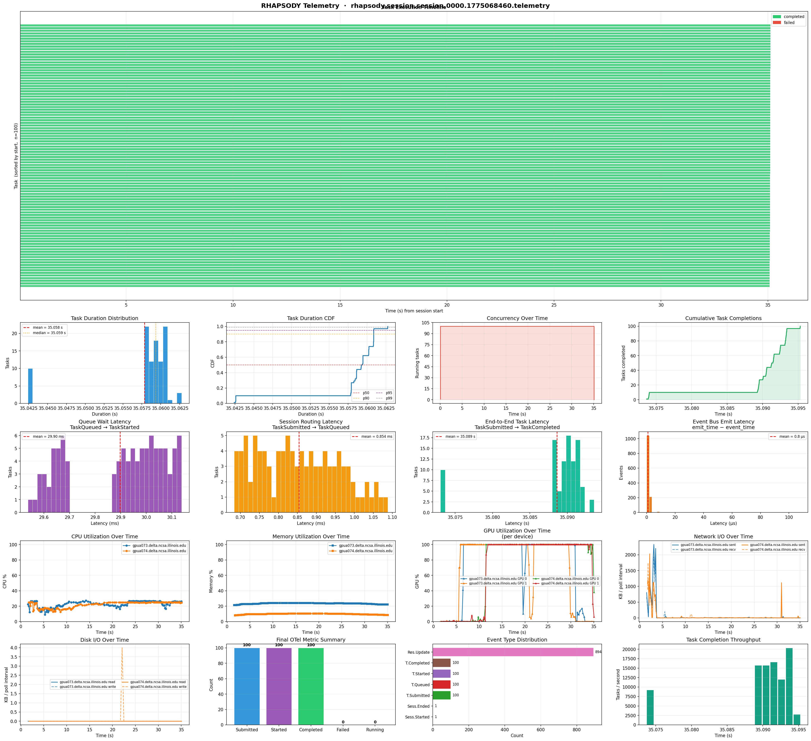

# Integrations & Extensions

RHAPSODY telemetry is built on the **OpenTelemetry Python SDK** and outputs a portable JSONL checkpoint file. This page shows how to connect it to external observability platforms and how to build your own analytics components on top of it.

---

## OTel compatibility

RHAPSODY uses `opentelemetry-sdk` internally with **in-memory providers** (no exporter configured by default). You can replace or augment these providers to forward data to any OTel-compatible backend.

### What RHAPSODY produces

| Signal | OTel type | Provider |
|---|---|---|
| Task / session traces | Spans (`ReadableSpan`) | `TracerProvider` → `InMemorySpanExporter` |
| Counters, gauges, histograms | Metrics (`MetricsData`) | `MeterProvider` → `InMemoryMetricReader` |
| Raw events | JSONL file lines | RHAPSODY checkpoint writer |

### Connecting an OTLP exporter (Jaeger, Tempo, Dynatrace…)

Because RHAPSODY uses the standard OTel SDK, you can add any exporter **before** calling `start_telemetry()`:

```python
from opentelemetry.sdk.trace import TracerProvider
from opentelemetry.sdk.trace.export import BatchSpanProcessor
from opentelemetry.exporter.otlp.proto.grpc.trace_exporter import OTLPSpanExporter

# Build a custom TracerProvider with an OTLP exporter
provider = TracerProvider()
provider.add_span_processor(
    BatchSpanProcessor(OTLPSpanExporter(endpoint="http://localhost:4317"))
)

# Inject it before start_telemetry()
from opentelemetry import trace
trace.set_tracer_provider(provider)

telemetry = await session.start_telemetry(checkpoint_path="./tel/")
# … run session …
await session.close()   # stops telemetry automatically
```

All task spans will now appear in Jaeger / Grafana Tempo alongside the in-memory copy.

---

## Grafana + Prometheus (live dashboard)

This setup exports RHAPSODY metrics to Prometheus via the OTel Prometheus exporter, then visualizes them in Grafana.

### Step 1 — start Grafana and Prometheus in Docker

```bash
# prometheus.yml
cat > prometheus.yml << 'EOF'
global:
  scrape_interval: 5s
scrape_configs:
  - job_name: rhapsody
    static_configs:
      - targets: ['host.docker.internal:9464']
EOF

docker run -d --name prometheus \
  -p 9090:9090 \
  -v $(pwd)/prometheus.yml:/etc/prometheus/prometheus.yml \
  prom/prometheus

docker run -d --name grafana \
  -p 3000:3000 \
  --env GF_AUTH_ANONYMOUS_ENABLED=true \
  --env GF_AUTH_ANONYMOUS_ORG_ROLE=Admin \
  grafana/grafana-oss
```

### Step 2 — install the OTel Prometheus exporter

```bash
pip install opentelemetry-exporter-prometheus
```

### Step 3 — wire RHAPSODY metrics to the exporter

```python
from opentelemetry.sdk.metrics import MeterProvider
from opentelemetry.exporter.prometheus import PrometheusMetricReader
from prometheus_client import start_http_server

# Serve Prometheus metrics on port 9464
start_http_server(port=9464)
reader = PrometheusMetricReader()
provider = MeterProvider(metric_readers=[reader])

from opentelemetry import metrics
metrics.set_meter_provider(provider)

telemetry = await session.start_telemetry(
    resource_poll_interval=5.0,
    checkpoint_path="./tel/",
)
```

### Step 4 — import the Grafana dashboard

Open `http://localhost:3000`, add Prometheus (`http://localhost:9090`) as a data source, and create panels for:

| Panel | PromQL query |
|---|---|
| Tasks running | `tasks_running` |
| Task throughput | `rate(tasks_completed[1m])` |
| Task failure rate | `rate(tasks_failed[1m])` |
| CPU utilization | `node_cpu_utilization` |
| GPU utilization | `node_gpu_utilization` |
| Memory utilization | `node_memory_utilization` |

---

## Building a custom analytics component

Any Python object that can receive a `BaseEvent` can be wired into RHAPSODY as a subscriber. The subscriber runs **inside the session process** and receives every event in real time.

### Example: per-task SLA monitor

```python
from rhapsody.telemetry import TelemetrySubscriber
from rhapsody.telemetry.events import TaskCompleted, TaskFailed

SLA_SECONDS = 30.0

class SLAMonitor:
    def __init__(self, telemetry):
        sub = TelemetrySubscriber(telemetry)
        sub.subscribe(self._on_event)
        self.violations: list[dict] = []

    def _on_event(self, event):
        if isinstance(event, TaskCompleted):
            if event.duration_seconds > SLA_SECONDS:
                self.violations.append({
                    "task_id":  event.task_id,
                    "duration": event.duration_seconds,
                    "backend":  event.backend,
                })
        elif isinstance(event, TaskFailed):
            self.violations.append({
                "task_id":    event.task_id,
                "error_type": event.error_type,
                "backend":    event.backend,
            })

    def report(self):
        print(f"{len(self.violations)} SLA violations detected")
        for v in self.violations:
            print(v)


# Usage
telemetry = await session.start_telemetry()
monitor = SLAMonitor(telemetry)

async with session:
    await session.submit_tasks(tasks)
    await session.wait_tasks(tasks)
# session.close() called by async with — stops telemetry automatically

monitor.report()
```

### Example: GPU overload alerting

```python
from rhapsody.telemetry.events import ResourceUpdate

GPU_ALERT_THRESHOLD = 95.0

def gpu_alert(event):
    if not isinstance(event, ResourceUpdate):
        return
    if event.resource_scope == "per_gpu" and event.gpu_percent is not None:
        if event.gpu_percent >= GPU_ALERT_THRESHOLD:
            print(
                f"[ALERT] GPU {event.gpu_id} on {event.node_id}: "
                f"{event.gpu_percent:.1f}% — threshold {GPU_ALERT_THRESHOLD}%"
            )

telemetry.subscribe(gpu_alert)
```

### Example: forwarding to MLflow

```python
import mlflow
from rhapsody.telemetry.events import SessionEnded

def mlflow_reporter(event):
    if isinstance(event, SessionEnded):
        with mlflow.start_run():
            summary = telemetry.summary()
            mlflow.log_metric("tasks_completed", summary["tasks"]["completed"])
            mlflow.log_metric("tasks_failed",    summary["tasks"]["failed"])
            mlflow.log_metric("session_duration", summary["duration_seconds"])
            if summary["duration"]:
                mlflow.log_metric("mean_task_duration_s", summary["duration"]["mean_seconds"])

telemetry.subscribe(mlflow_reporter)
```

---

## Replaying a JSONL checkpoint

The JSONL file can be replayed or analyzed offline with any tool that understands newline-delimited JSON.

### jq — quick inspection

```bash
# Count events by type
jq -r 'select(.section=="event") | .event_type' run.jsonl | sort | uniq -c | sort -rn

# Find slowest tasks
jq 'select(.section=="span" and .name=="task") | {task_id: .attributes.task_id, duration_ms}' \
   run.jsonl | jq -s 'sort_by(.duration_ms) | reverse | .[0:10]'

# Tail resource events live
tail -f run.jsonl | jq 'select(.event_type=="ResourceUpdate") | {resource_scope, node_id, gpu_id, cpu_percent, gpu_percent}'
```

### pandas — time-series analysis

```python
import json
import pandas as pd

records = []
with open("run.jsonl") as f:
    for line in f:
        obj = json.loads(line)
        if obj.get("section") == "event" and obj.get("event_type") == "ResourceUpdate":
            records.append(obj)

df = pd.DataFrame(records)
df["ts"] = pd.to_datetime(df["event_time"], unit="s")
df.set_index("ts", inplace=True)

# Plot CPU per node
df[df["resource_scope"] == "per_node"].groupby("node_id")["cpu_percent"].plot(legend=True)
```

---

## Trace correlation across components

Every event in the JSONL file carries `trace_id` and `span_id`. If an external component (e.g., an ML training framework or workflow orchestrator) is also OTel-instrumented, you can propagate the RHAPSODY session `trace_id` to create a **unified trace** across systems.

```python
from opentelemetry import trace

# After telemetry.start() the session span is active
session_ctx = telemetry._session_span.get_span_context()
trace_id = hex(session_ctx.trace_id)

# Pass trace_id to an external component so it can attach its spans
external_component.run(parent_trace_id=trace_id)
```

In a Grafana Tempo or Jaeger UI you can then search by `trace_id` and see the session span, all task spans, and any external component spans in a single flame graph.

---

## Session → Task → Resource hierarchy

The OTel parent-child model used by RHAPSODY maps directly onto the trace hierarchy:

```
Trace (one per session)
└── session span  [SessionStarted … SessionEnded]
    │
    ├── task span  [TaskStarted … TaskCompleted]   task_id=A
    ├── task span  [TaskStarted … TaskFailed]       task_id=B
    ├── task span  [TaskStarted … TaskCompleted]   task_id=C
    │   ⋮
    │
    └── ResourceUpdate events (linked to session span via span_id)
        ├── resource_scope="per_node", node_id=node0, gpu_id=null   (aggregate)
        ├── resource_scope="per_gpu",  node_id=node0, gpu_id=0
        ├── resource_scope="per_gpu",  node_id=node0, gpu_id=1
        └── …
```

This hierarchy means:

- You can query "all tasks in session X" by filtering on `trace_id`.
- You can query "all resource metrics during task Y's execution" by joining on `trace_id` and the task's `span_id` time window.
- External OTel tools (Jaeger, Tempo) display this as a natural flame graph with session as the root and tasks as child spans.

---

## Real run visualization

The image below is the plot generated from an actual RHAPSODY session using `python examples/plot.py`. It shows CPU, memory, GPU utilization, disk and network I/O, task throughput, and a task lifetime timeline — all derived from a single JSONL checkpoint file.



The panels are:

1. **CPU utilization** — per node, `resource_scope="per_node"` events only
2. **Memory utilization** — per node
3. **GPU utilization** — `resource_scope="per_gpu"` events, one line per device; falls back to the `per_node` aggregate `gpu_percent` when per-device data is absent
4. **Disk I/O** — read and write bytes per interval
5. **Network I/O** — sent and received bytes per interval
6. **Tasks running** — concurrent task count over time
7. **Task throughput** — completions per second in rolling windows
8. **Task lifetime** — horizontal bars showing each task's RUNNING → DONE/FAILED span, colored by status
